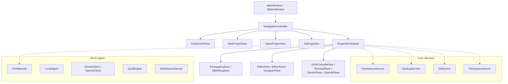

# Deep Analysis: Parcel C++ Project

## 📋 Executive Summary

**Parcel C++** is a sophisticated, AI-driven Industrial Development Toolkit and IDE built on **Qt 6** (utilizing Widgets, WebEngine, Quick, Sql, Charts, and Network). It combines multi-agent artificial intelligence (the **SS AI Agent** suite), a high-performance C++/QML visual designer, advanced file tree and database explorers, robust SQLite-backed session/backup versioning, and strict adherence to **SSQLM** (Shell Script Quality Language Model) standards.

---

## 🏛️ Architecture & Project Structure

The project is structured into clean modular layers:

### 1. Core & Navigation (`src/core/`)
- **[NavigationController.hpp](file:///home/marcel/Parcel-Suite/Parcel%20C++/src/core/navigation/NavigationController.hpp)**: Centralized singleton managing view switching (`NavigationTarget`) across workspace and global views.
- **Constants & Version**: Global identifiers and versioning (`1.0.0`).

### 2. Services (`src/service/`)
- **[BackupService.hpp](file:///home/marcel/Parcel-Suite/Parcel%20C++/src/service/BackupService.hpp)**: Incremental, SQLite-backed project versioning and rollback snapshots.
- **[PersistenceService.cpp](file:///home/marcel/Parcel-Suite/Parcel%20C++/src/service/PersistenceService.cpp)**: Secure state and configuration persistence.
- **[GitService.cpp](file:///home/marcel/Parcel-Suite/Parcel%20C++/src/service/GitService.cpp)** & **[FileSystemService.cpp](file:///home/marcel/Parcel-Suite/Parcel%20C++/src/service/FileSystemService.cpp)**: Native filesystem traversal and Git version control integration.
- **[PdfService.hpp](file:///home/marcel/Parcel-Suite/Parcel%20C++/src/service/PdfService.hpp)**: Built-in document generation and composition tools.

### 3. Views & Editors (`src/view/`)
- **[MainWindow.hpp](file:///home/marcel/Parcel-Suite/Parcel%20C++/src/view/MainWindow.hpp)**: Main application window hosting toolbars, status bars, and the central stacked navigation widget.
- **[ProjectWorkspace.hpp](file:///home/marcel/Parcel-Suite/Parcel%20C++/src/view/ProjectWorkspace.hpp)**: Comprehensive IDE workspace combining splitters, tabbed editors, sidebar tools, and terminal/AI console panes.
- **[EditorPane.cpp](file:///home/marcel/Parcel-Suite/Parcel%20C++/src/view/editor/EditorPane.cpp)** & **[DesignerPane.hpp](file:///home/marcel/Parcel-Suite/Parcel%20C++/src/view/editor/DesignerPane.hpp)**: Advanced syntax-highlighted code editor and visual UI designer.
- **[PackageExplorer.cpp](file:///home/marcel/Parcel-Suite/Parcel%20C++/src/view/explorer/PackageExplorer.cpp)** & **[DBMSExplorer.hpp](file:///home/marcel/Parcel-Suite/Parcel%20C++/src/view/explorer/DBMSExplorer.hpp)**: Tree-based project file explorer and database query/inspection explorer.

### 4. SS AI Agent & Intelligence Layer (`src/SS AI Agent/`)
- **[SSAIModule.cpp](file:///home/marcel/Parcel-Suite/Parcel%20C++/src/SS%20AI%20Agent/SSAIModule.cpp)**: Core bridge coordinating local agents, remote LLM clients, and python execution scripts.
- **[LocalAgent.cpp](file:///home/marcel/Parcel-Suite/Parcel%20C++/src/SS%20AI%20Agent/LocalAgent.cpp)**: Heavy-duty local heuristic reasoning engine (1000+ lines).
- **[GeminiClient.cpp](file:///home/marcel/Parcel-Suite/Parcel%20C++/src/SS%20AI%20Agent/GeminiClient.cpp)** & **[OpenAIClient.cpp](file:///home/marcel/Parcel-Suite/Parcel%20C++/src/SS%20AI%20Agent/OpenAIClient.cpp)**: HTTP clients integrating Google Gemini and OpenAI APIs.
- **[QLMEngine.cpp](file:///home/marcel/Parcel-Suite/Parcel%20C++/src/SS%20AI%20Agent/QLMEngine.cpp)**: Shell Script Quality Language Model evaluator and rule validator.
- **[WebSearchService.cpp](file:///home/marcel/Parcel-Suite/Parcel%20C++/src/SS%20AI%20Agent/WebSearchService.cpp)**: Real-time web retrieval and knowledge synthesis.

### 5. QLM Standards & Rules (`QLM/`)
- JSON-based rule definitions (`agent_core.json`, `capabilities.json`, `code_review_logic.json`, `security_standards.json`, etc.) governing agent behavior, code auditing, and security checks.

---

## 🛠️ Build Configuration

- **Build System:** CMake 3.16+ with C++17 standard requirements (`CMAKE_EXPORT_COMPILE_COMMANDS ON`, AUTOMOC, AUTOUIC, AUTORCC).
- **Qt 6 Modules:** `Widgets`, `WebEngineWidgets`, `PrintSupport`, `Sql`, `Charts`, `Quick`, `QuickWidgets`, `Network`.
- **Target Output:** `Parcel C++` executable for Linux environments.

---

## 🚀 Strategic Roadmap & Future Expansion (from Next Messages AI)

1. **Visual UI Designer Enhancements:** ComboBox component inspector for active layout items.
2. **KDE Framework & KDevelop Integration:** Incorporating KDE API (`api.kde.org`, Kirigami) and KDevelop components across the IDE.
3. **.NET Framework Interop:** LINQ and Entity Framework bridges for multi-language development.
4. **Game Development & Blueprint Engine:** Visual blueprint-to-C++ conversion and game development module.
5. **Multi-Engine Web Architecture:** Unifying QtWebEngine, Chromium (Photon), and Gecko engines.
6. **OS & Distro Builder:** Linux distribution creation module.

---

## ⚖️ Licensing & Governance
- **Strict Proprietary Software License Agreement** owned by **Marcel Aparecido de Andrade**. All trade secrets (SS AI Agent, SSQLM algorithms) are protected against unauthorized redistribution and reverse engineering.
