# Deep Analysis: Parcel C++ Project (Updated Architecture & Multi-Framework Studios)

## 📋 Executive Summary

**Parcel C++** is a state-of-the-art, AI-driven Industrial Development Toolkit and IDE built on **Qt 6** (Widgets, WebEngine, Quick, Sql, Charts, Network) and C++17. It integrates multi-agent artificial intelligence (the **SS AI Agent** suite), a high-performance C++/QML visual designer with a dynamic component selector, SQLite-backed incremental session versioning, and comprehensive cross-framework support for **KDE Frameworks 6**, **.NET 8/9 (LINQ & EF Core)**, **GTK 4**, **GTK 3**, and **GTK 2**.

---

## 🏛️ Architecture & Project Structure

The project is structured into clean, modular layers:

```mermaid
graph TD
    A[MainWindow / QMainWindow] --> B[NavigationController]
    B --> C[DashboardView]
    B --> D[NewProjectView]
    B --> E[OpenProjectView]
    B --> F[SettingsView]
    B --> G[ProjectWorkspace]

    G --> H[PackageExplorer / DBMSExplorer]
    G --> I[EditorHost / EditorPane / DesignerPane]
    G --> J[Multi-Framework Studios: KDE / .NET / GTK4 / GTK3 / GTK2]
    G --> K[SSAIConsolePane / TerminalPane / GeminiPane / OpenAIPane]

    subgraph Native Backend Services
        L[PersistenceService]
        M[BackupService]
        N[GitService]
        O[FileSystemService]
        P[KDEIntegrationService / KDEManager]
        Q[DotNetIntegrationService / DotNetService / DotNetManager]
        R[GTK4IntegrationService / GTK4Manager]
        S[GTK3IntegrationService / GTK3Manager]
        T[GTK2IntegrationService / GTK2Manager]
    end

    subgraph SS AI Agent Suite
        U[SSAIModule]
        V[LocalAgent]
        W[GeminiClient / OpenAIClient]
        X[QLMEngine]
        Y[WebSearchService]
    end

    G -.-> L & M & N & O
    G -.-> P & Q & R & S & T
    G -.-> U
```

---

## 🎨 Key Features & Subsystems

### 1. Visual UI Designer & Component Selector (`[DesignerPane.hpp](file:///home/marcel/Parcel-Suite/Parcel%20C++/src/view/editor/DesignerPane.hpp)`)
- Drag-and-drop Qt Quick & KDE Kirigami visual editor.
- **Component Selector ComboBox:** Automatically populates with canvas elements (`[0] button_0 (Button)`), offering real-time bidirectional selection (selecting via dropdown updates canvas and property inspector, and vice versa). Appears conditionally only when elements are placed.
- Live QML code generation, Undo/Redo stack, Copy/Paste, and Blueprint Logic Graph engine (`BlueprintPane`).

### 2. Multi-Framework Integration Studios (`src/service/` & `src/view/`)
- **KDE Frameworks 6 & Kirigami (`KDEManager` / `KDEPane`):** Full integration with `api.kde.org`, Kirigami QML application generators, KF6 CMake builders, and Breeze Dark theme palettes.
- **.NET 8/9, LINQ & Entity Framework Core (`DotNetService` / `DotNetManager` / `DotNetPane`):** Asynchronous .NET CLI process execution, EF Core migration helpers (`dotnet ef`), C# LINQ expression generators, and `.csproj` scaffolding.
- **GTK 4 Suite (`GTK4Manager` / `GTK4Pane`):** C++ source code generators for `GtkApplication`, GSK/GDK rendering, and Adwaita Dark CSS theming (`GtkCssProvider`).
- **GTK 3 Suite (`GTK3Manager` / `GTK3Pane`):** Legacy GTK+ 3 C++ application templates and CSS stylesheet generators.
- **GTK 2 Legacy Suite (`GTK2Manager` / `GTK2Pane`):** Support for legacy GTK+ 2 C code generation and window/widget setup.

### 3. SS AI Agent & Intelligence Layer (`src/SS AI Agent/`)
- Multi-model routing (LocalAgent heuristic reasoning, Gemini, OpenAI, Python execution scripts).
- Real-time web retrieval (`WebSearchService`) and Shell Script Quality Language Model (`QLMEngine`) rule enforcement.

---

## 🛠️ Build & Environment Configuration

- **Build System:** CMake 3.16+ (`set(CMAKE_CXX_STANDARD 17)`, `CMAKE_EXPORT_COMPILE_COMMANDS ON`, AUTOMOC, AUTOUIC, AUTORCC).
- **Qt 6 Modules:** `Widgets`, `WebEngineWidgets`, `PrintSupport`, `Sql`, `Charts`, `Quick`, `QuickWidgets`, `Network`.
- **Executable Target:** `Parcel C++` (`build/Parcel C++`).

---

## 📄 Documentation Index (`resource/docs/`)

- 📘 [visual_designer_combobox.md](file:///home/marcel/Parcel-Suite/Parcel%20C++/resource/docs/visual_designer_combobox.md)
- 📘 [kde_implementation_summary.md](file:///home/marcel/Parcel-Suite/Parcel%20C++/resource/docs/kde_implementation_summary.md)
- 📘 [dotnet_implementation_summary.md](file:///home/marcel/Parcel-Suite/Parcel%20C++/resource/docs/dotnet_implementation_summary.md)
- 📘 [gtk4_implementation_summary.md](file:///home/marcel/Parcel-Suite/Parcel%20C++/resource/docs/gtk4_implementation_summary.md)
- 📘 [gtk3_implementation_summary.md](file:///home/marcel/Parcel-Suite/Parcel%20C++/resource/docs/gtk3_implementation_summary.md)
- 📘 [gtk2_implementation_summary.md](file:///home/marcel/Parcel-Suite/Parcel%20C++/resource/docs/gtk2_implementation_summary.md)
